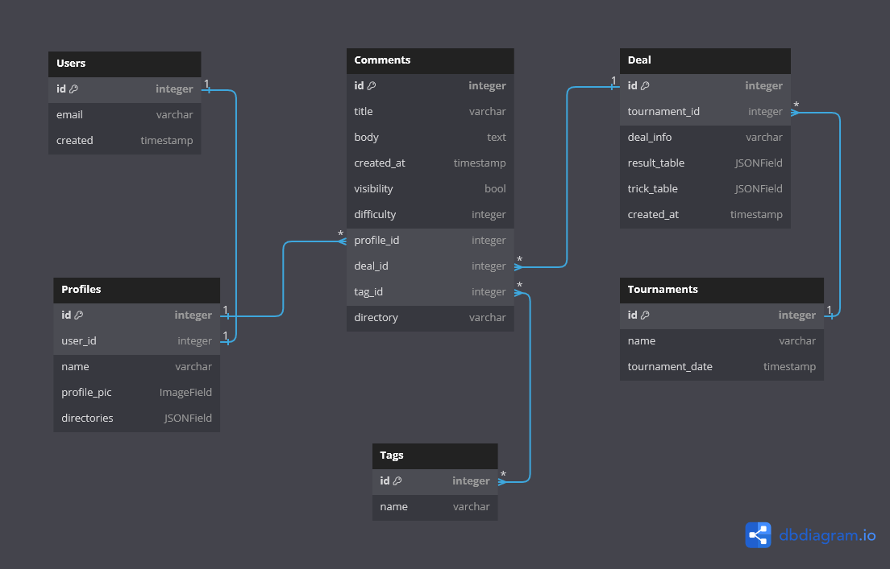
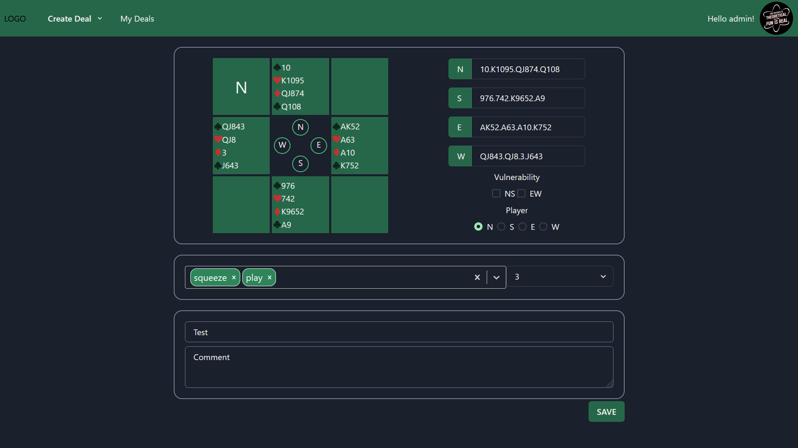
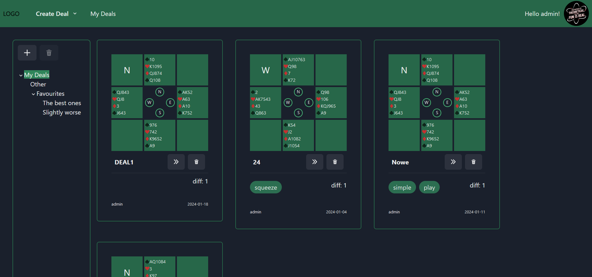
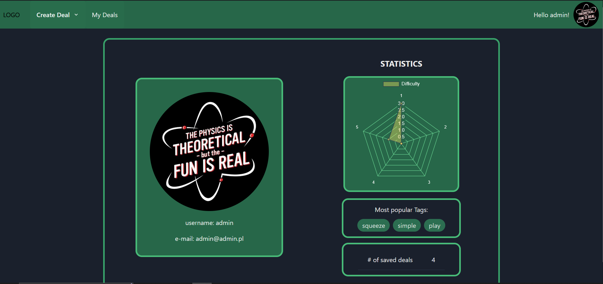

# Bridge deals library

## Table of Contents
* [General Info](#general-information)
* [Technologies Used](#technologies-used)
* [Features](#features)
* [Setup](#setup)
* [Database Structure](#database-structure)
* [Application View](#application-view)
* [Project Status](#project-status)
* [Future Plans](#future-plans)


## General Information
This application allows user to create theirs own library of bridge deals. Every single deal can be commented, rated accordingly to the difficulty level and appropriately tagged. Deals can be created from scratch or scrapped from external sources.

## Technologies Used
<ul>
<li>Django</li>
<li>DRF</li>
<li>Celery</li>
<li>JavaScript</li>
<li>HTML5 & CSS3</li>
<li>ChakraUI</li>
<li>React Router</li>
<li>Docker, docker-compose</li>
</ul>

## Features

* Registration/Login
* Custom deal creator
* Scrapping single deal from outside source
* Scrapping all deals played during a single Tournament
* Comment, add tags and rate your deals
* Convenient directory system to help organise your personal deal library
* Personalised statistics summary page

## Setup

```bash
# Clone this repository
$ git clone https://github.com/MarcinRubin/Bridge_Deals_Library

# Create file .env where your environemntal variables wil be stored:
  SECRET_KEY='ENTER YOUR DJANGO SECRET KEY'
  SQL_DATABASE='YOUR DATABASE NAME'
  SQL_USER='YOUR DATABASE USERNAME'
  SQL_PASSWORD='YOUR DATABASE PASSWORD'
  DEBUG=True
  SQL_ENGINE=django.db.backends.postgresql
  SQL_HOST=db
  SQL_PORT=5432
  CELERY_BROKER=redis://redis:6379/0
  CELERY_BACKEND=redis://redis:6379/0_app

# Build the project using docker-compose
$ docker-compose up --build
```

## Database Structure



## Application View
<h3>Create new deal</h3>



<h3>Deals in library</h3>



<h3>Statistics</h3>



## Project Status
Project is: _in progress_


## Future Plans

- Changing/resetting password
- Uploading custom avatars
- Possibility to browse other users deal libraries
- Add interaction between users (ability to add, comment on, rate deals already in the other user's library)
- Extend the scrapping feature to other websites
- Provide the tools for users to
  write their own scrapping modules.
- Optional Feature: Adding deal analyser
